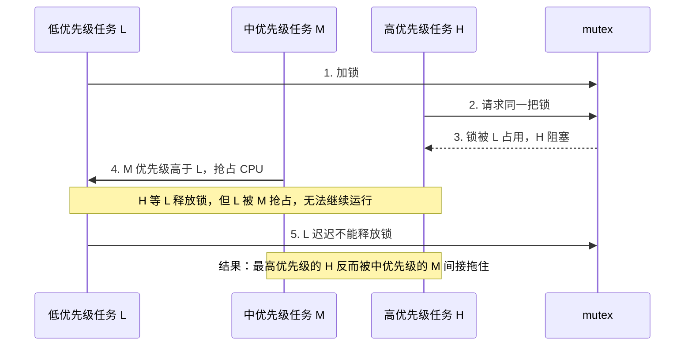

优先级翻转是：**低优先级任务占着高优先级任务需要的资源，导致高优先级任务被阻塞；同时中优先级任务又抢占 CPU，让低优先级任务无法释放资源。**

结果就是：**高优先级任务反而被中优先级任务间接拖住**，看起来像优先级被“翻转”了。

## 例子

1. 低优先级任务 L 拿了锁 `mutex`
2. 高优先级任务 H 也需要这个锁，于是被阻塞
3. 中优先级任务 M 开始运行，抢占了 L
4. L 没机会继续执行，也就没机会释放锁
5. H 明明优先级最高，却一直等着

**一句话总结：** H L 都想要锁，H 优先级高但被 L 占着，**M 优先级比 L 高但不需要锁却抢占了 CPU**，让 L 没机会释放锁，结果 H 被 M 间接拖住了。

## 图解

## 解决方式

- **优先级继承**：L 持有 H 需要的锁时，临时提升 L 的优先级，让它赶紧执行完释放锁。
- **优先级天花板协议**：任务拿锁时直接提升到某个预设优先级，避免被中优先级任务打断。

一句话：**优先级翻转不是调度器把优先级搞反了，而是锁/资源竞争让高优先级任务被低优先级任务间接卡住。**
