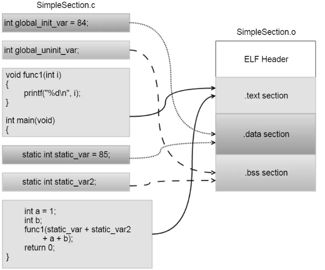

ELF 是 **Executable and Linkable Format** 的缩写，是 Linux/Unix 常见的二进制文件格式。

它可以表示：

- 可执行文件
- 目标文件 `.o`
- 共享库 `.so`
- core dump 文件

ELF 文件可以从两个角度理解：

```text
链接视角：ELF Header + Sections + Section Header Table
运行视角：ELF Header + Program Header Table + Segments
```

简单说：

```text
ELF Header：整个文件的总说明
Program Header Table：告诉系统怎么把文件加载到内存运行
Sections：链接器、调试器看到的各种内容块
Section Header Table：描述每个 section 的索引表
```

## 1. ELF Header

ELF Header 位于文件最开头，用来描述整个 ELF 文件的基本信息。

常见信息包括：

- 魔数：判断是不是 ELF 文件，通常是 `0x7f 45 4c 46`
- 位数：32 位还是 64 位
- 字节序：大端还是小端
- 文件类型：可执行文件、目标文件、共享库、core dump
- 目标架构：x86、ARM、RISC-V 等
- 入口地址：程序开始执行的位置
- Program Header Table 的位置
- Section Header Table 的位置

可以用下面命令查看：

```bash
readelf -h a.out
```

## 2. Program Header Table

Program Header Table 是给**程序加载器**看的。

程序运行时，内核和动态链接器主要根据 Program Header Table 把 ELF 文件加载到内存。

常见类型包括：

- `LOAD`：需要加载到内存的段
- `DYNAMIC`：动态链接信息
- `INTERP`：动态链接器路径
- `PHDR`：Program Header Table 自身的位置

例如动态链接程序里可能会有：

```text
INTERP -> /lib64/ld-linux-x86-64.so.2
```

可以用下面命令查看：

```bash
readelf -l a.out
```

## 3. Sections

Section 是链接视角下的组织单位。

最常见、最应该先记住的是这四个。把它们放到进程运行时的典型内存布局里看，堆和栈大概在下面这些位置：

```text
        高地址
          ↑
          │
┌────────────────────────────────────────┐
│ stack   栈：局部变量、函数调用现场      │  向低地址增长
├────────────────────────────────────────┤
│ mmap    独立映射区：共享库、文件映射等  │
├────────────────────────────────────────┤
│ heap    堆：malloc / new 动态分配内存   │  向高地址增长
├────────────────────────────────────────┤
│ .bss    未初始化的全局变量、静态变量    │  没初值
├────────────────────────────────────────┤
│ .data   已初始化的全局变量、静态变量    │  有初值
├────────────────────────────────────────┤
│ .rodata 只读数据，比如字符串常量        │  只读
├────────────────────────────────────────┤
│ .text   程序代码                        │  要执行
└────────────────────────────────────────┘
          │
          ↑
        低地址
```

注意：堆、栈、mmap 区域都不是 ELF 文件里的 section，它们是程序运行后由内核在进程虚拟地址空间里建立和管理的内存区域。mmap 是独立的虚拟内存映射区域，不属于堆；只是典型布局里常画在堆和栈之间。

程序和 sections 的对应关系：



记忆方式：

```text
.text   -> code
.rodata -> read only data
.data   -> initialized data
.bss    -> zero/uninitialized data
```

常见 section 有：

```text
.text       机器指令代码
.rodata     只读数据，比如字符串常量
.data       已初始化的全局变量、静态变量
.bss        未初始化的全局变量、静态变量
.symtab     符号表
.strtab     字符串表
.dynsym     动态符号表
.dynstr     动态字符串表
.rela.*     重定位信息
.plt        过程链接表
.got        全局偏移表
.debug_*    调试信息
```

可以用下面命令查看：

```bash
readelf -S a.out
```

## 4. Section Header Table

Section Header Table 用来描述每个 section。

它记录的信息包括：

- section 名字
- section 类型
- 文件偏移
- 大小
- 地址
- 权限属性
- 对齐方式

Section Header Table 主要给链接器、调试器、`readelf`、`objdump` 这类工具使用。

注意：一个 ELF 文件即使没有 Section Header Table，也可能可以正常运行。

## 5. Segment 和 Section 的区别

Section 是**链接视角**，Segment 是**运行视角**。

```text
Section：给链接器、调试器、分析工具看
Segment：给内核、动态链接器、加载器看
```

一个 Segment 通常可以包含多个 Section。

例如：

```text
代码 LOAD Segment
├── .text
└── .rodata

数据 LOAD Segment
├── .data
└── .bss
```

## 6. 常用查看命令

```bash
readelf -h a.out      # 查看 ELF Header
readelf -l a.out      # 查看 Program Headers / Segments
readelf -S a.out      # 查看 Section Headers / Sections
readelf -s a.out      # 查看符号表
objdump -d a.out      # 反汇编 .text
file a.out            # 查看文件类型概况
```

## 7. binutils 常用工具

binutils 是 GNU 提供的一组二进制文件处理工具，常用来处理目标文件、静态库、ELF、符号表、反汇编和链接。

可以按用途这样记：

```text
编译汇编：as
链接程序：ld
查看分析：readelf / objdump / nm / size / strings
格式转换：objcopy
裁剪符号：strip
静态库：ar / ranlib
地址解析：addr2line
符号解码：c++filt
```

常见工具如下：

```text
as          汇编器，把汇编代码生成目标文件 .o
ld          链接器，把 .o、库文件链接成可执行文件或共享库
ar          创建、修改、查看静态库 .a
ranlib      给静态库生成索引，加快链接速度
nm          查看目标文件、库、可执行文件里的符号
objdump     查看目标文件信息，常用于反汇编
readelf     专门查看 ELF 文件结构
objcopy     复制并转换目标文件格式，也可以提取 section
strip       删除符号表、调试信息，减小文件体积
size        查看 .text、.data、.bss 等 section 大小
strings     从二进制文件中提取可打印字符串
addr2line   把地址转换成源码文件名和行号
c++filt     还原 C++ 符号名
elfedit     修改 ELF Header 中的一些字段
```

几个常用例子：

```bash
readelf -h a.out      # 查看 ELF Header
readelf -S a.out      # 查看 section 表
readelf -l a.out      # 查看 program header
objdump -d a.out      # 反汇编 .text
nm a.out              # 查看符号表
size a.out            # 查看 text/data/bss 大小
strings a.out         # 查看可打印字符串
```

一句话：**分析 ELF 时，优先记住 `readelf`、`objdump`、`nm`、`size`、`objcopy`、`strip` 这几个。**

## 总结

```text
ELF Header：说明这个 ELF 文件是什么
Program Header Table：说明怎么加载到内存运行
Sections：保存代码、数据、符号、重定位、调试信息等内容
Section Header Table：说明每个 section 在哪里、大小多少、属性是什么
```

一句话：**ELF 既是链接器处理的文件格式，也是操作系统加载程序时使用的文件格式。**
